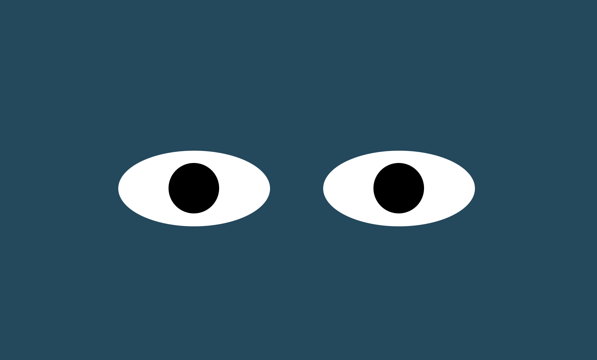

# Eye-Movement

DESCRIPTION

Using JavaScript with 'onMouseMove' event to make every mouse move make the pupils of the eyes follow.

How to run:

. Clone the repository into your local environment

. Open the index.html file

. Right click and select 'Open Default browser' to open the project in your default browser.

Roadmap of future improvements:
Make changes to color of the background and the eyes themselves.

See it here:

